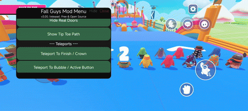
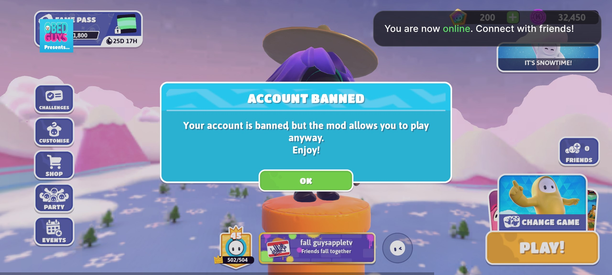
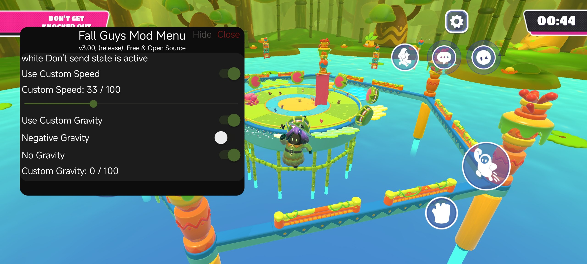
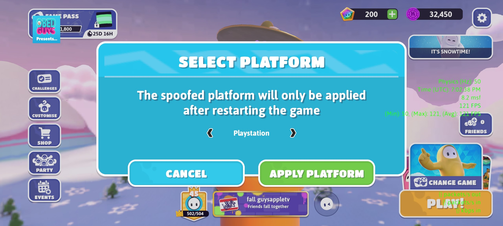

> [!WARNING]  
> This project is for **educational and research purposes only**.  
> The author is **not responsible** for bans or any damage.  
> **Use at your own risk.**

# Fall Guys Mod Menu
Android Fall Guys mod menu using [Frida](https://frida.re/) and [frida-il2cpp-bridge](https://github.com/vfsfitvnm/frida-il2cpp-bridge)

For updates announcements join our community in Discord:
[Make FG Great Again Discord Server](https://discord.gg/cNFJ73P6p3) 

## 📸 Showcase

  
<b>📸 Screenshots</b> (click to expand)

  
  
  

## ✨ Features
### Movement
- **360 Dives**
- **Air Jump**
- **Freeze Player**
- **Don't send Fall Guy state:** Stop sending packets to server
- **Change Speed**
- **Change Vertical Gravity:** Normal / Zero / Negative
- **Change Jump and Dive Strength**

### Rounds helper
- **Door Dash / Lost Temple:** Hide Real Doors
- **Tip Toe:** Hide Fake Platforms

### Teleports
- **Teleport To Finish or Crown**
- **Teleport to Score Points** *(e.g., Bubbles)* **or Active Buttons**

### Other
- **View Names Shortcut Button**
- **Change FOV**
- **Toggle Display UI**
- **Display FGDebug:**
  - Shows FPS (min/max/avg/current), Time, Ping, Dropped Packets
- **Disable FG Analytics** 
- **Show Number of Queued Players** in matchmaking
- **Change Game Resolution**
- **Show Game Details**
  - Shows RoundID, seed and Eliminated Players
- **Show Server Details**
  - Shows Server IP, Host and Ping
- **UwUify Game**
- **Spoof Platform**
- **Show Build Info**
- **Login Using Refresh Token**

### Always Active
- **Bypass Character Physics Checks**
- **Remove FPS Limit**
- **Anti-AFK**
- **Bypass Permanent Ban** *(does not affect temporary bans)*
- **Automatically spoof to the latest game version**

### For developers
- **Spoof Login, Gateway and analytics server** *(requires script edit)*
- **Show Unity Logs**
- **Wrapper for In-Game Popup Manager**
  

## 📦 Installation
Just download and install the .apk from [Releases](https://github.com/repinek/fallguys-frida-modmenu/releases/latest)  
Not working? Look [🛠️ Troubleshooting](#%EF%B8%8F-troubleshooting)

> **Tip regarding OBB files:**  
> If you don't want to wait for game resources to download again:
> 1. Copy the `.obb` file from `Android/obb/com.Mediatonic.FallGuys_client/`.
> 2. Create a new folder: `Android/obb/com.Mediatonic.FallGuys_client.modmenu/`.
> 3. Paste the file there and rename it by adding `.modmenu` before `.obb`.  
> *Example:* `main.XXXX.com.mediatonic.FallGuys_client.modmenu.obb`

## 🛠️ Troubleshooting
> This project is for **educational and research purposes only**. I won't be providing support.

**Q:** How do I know if the menu is loaded?  
**A:** You will see a toast notification when you open Fall Guys.

**Q:** The menu doesn't appear.  
**A:** Ensure you granted the "Display over other apps" permission. The game should ask for it on the first launch. If not, grant it manually.

**Q:** Is Android 16 supported?  
**A:** No. This project uses Frida 16.7.19, which is not support 16 Android 

**Q:** Why frida 16.7.19 is used instead 17.1.4 with Android 16 support?  
**A:** Since frida-java-menu builded on 16.7.19, It can't be loaded on 17+. Probably issue: `Current thread is not attached to the Java VM; please move this code inside a Java.perform() callback`  
*Note: Frida 17 works in listen mode, but not in the script, because java is not loaded (?)*

**Q:** Are emulators supported?  
**A:** No. Emulators are not supported because they cannot handle the `frida-java-bridge` required for the menu.  

### ⚠️ Stability Issues
This mod relies on `frida-java-bridge`, which is **very unstable**. This results in random crashes and inconsistent behavior.

*   **The Issue:** The game may crash immediately upon calling Java methods, even if Frida reports `Java.available = true`.

**HyperOS, ColorOS, OneUI, HarmonyOS**, and other **OEM ROMs** may not work properly or at all.   
**It is recommended to use ROMs with minimal changes to ART (mainly AOSP forks).**    

### 💡 Alternative Solution
If you are unable to run this mod menu, we recommend checking out [**FGTools Mobile**](https://github.com/floyzi/FGToolsMobile) by [Floyzi](https://github.com/floyzi).

## 🧑‍💻 Development & Building
Want to build the APK yourself, debug the code, or contribute new features?

**Please read our [CONTRIBUTING.md](CONTRIBUTING.md) guide.**

It covers:
*   Project Structure
*   Building from source
*   Debugging with Frida Gadget
*   Code Style & Tools

## 🤝 Contribution
Pull requests are welcome! Got ideas or questions? Join our [Discord](https://discord.gg/cNFJ73P6p3).

## 📜 License
This project is licensed under the **GNU General Public License v3.0**.  
See the [LICENSE](LICENSE) file for details.

## 🙏 Special Thanks
Obed Guys Team - Some features powered by **Obed Guys Team**.  
[Floyzi](https://github.com/floyzi) - For how the game works, help with some features, localization.  
[commonuserlol](https://github.com/commonuserlol) - For help with code and [menu](https://github.com/commonuserlol/frida-java-menu).  
[Dynasty-Dev](https://github.com/Dynasty-Dev) - For testing & contribution.  
[igamegod](https://github.com/igamegod) - For help with some features.  
[Gene Brawl](https://github.com/RomashkaTea/genebrawl-public) - For the Webpack build configuration.  

[Frida](https://frida.re/) - An amazing dynamic instrumentation toolkit.  
[frida-il2cpp-bridge](https://github.com/vfsfitvnm/frida-il2cpp-bridge/) - The incredible frida module for IL2CPP.

# Disclaimer

This project is **NOT** affiliated with Mediatonic or Epic Games.

**Fall Guys** is a trademark of **Mediatonic Limited**.
